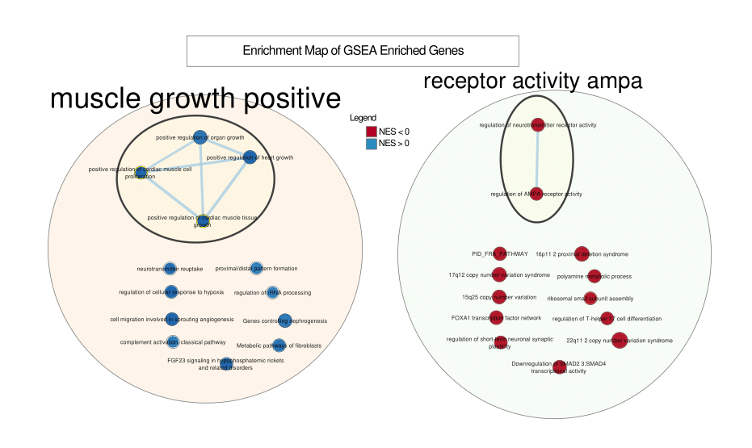

```{r setup, include=FALSE}
knitr::opts_chunk$set(echo = TRUE, error = FALSE)
```
```{r, include = FALSE, message = FALSE, warning = FALSE}
if (!requireNamespace("BiocManager", quietly = TRUE))
    install.packages("BiocManager")
if (!requireNamespace("devtools", quietly = TRUE))
    install.packages("devtools")
if (!requireNamespace("dplyr", quietly = TRUE))
    install.packages("dplyr")
if (!requireNamespace("DESeq2", quietly = TRUE))
    install.packages("DESeq2")
if (!requireNamespace("edgeR", quietly = TRUE))
    install.packages("edgeR")
if (!requireNamespace("limma", quietly = TRUE))
    install.packages("limma")
if (!requireNamespace("ComplexHeatmap", quietly = TRUE))
    install.packages("ComplexHeatmap")
if (!requireNamespace("circlize", quietly = TRUE))
    install.packages("circlize")

BiocManager::install("GEOquery")
BiocManager::install("biomaRt")
BiocManager::install("clusterProfiler")
BiocManager::install("org.Hs.eg.db")

library(DESeq2)
library(GEOquery)
library(dplyr)
library(edgeR)
library(limma)
library(ComplexHeatmap)
library(circlize)
library(biomaRt)
library(clusterProfiler)
library(org.Hs.eg.db)

#install required R and bioconductor packages
tryCatch(expr = { library("RCurl")}, 
         error = function(e) {  install.packages("RCurl")}, 
         finally = library("RCurl"))

# Setting up the necessary data variables from Assignment 1 for use in Assignment 2
# The chosen dataset
geoID <- "GSE208438"

# Path to store downloaded files
download_path <- file.path(getwd())

# Platform Information
gse <- getGEO(geoID, GSEMatrix = FALSE)
current_gpl <- names(GPLList(gse))[1]
current_gpl_info <- Meta(getGEO(current_gpl))

# Run the function to download only files that we do not already have
suppfiles <- getGEOSuppFiles(geoID, fetch_files = FALSE)
rna_data_files <- suppfiles$fname[!unlist(lapply(suppfiles$fname, FUN=function(file){
    file.exists(file.path(download_path, geoID, file))}))]

if(length(rna_data_files) > 0){
    for(x in 1:length(rna_data_files)){
        suppfile = getGEOSuppFiles(geoID, filter_regex = rna_data_files[x], baseDir = download_path, fetch_files = TRUE)
    }
}

# Load the downloaded files for processing
sMDDvsCTRL <- read.table(file.path(download_path, geoID, "GSE208438_sMDD_vs_CTRL_fCount.txt.gz"), header=TRUE, check.names=TRUE)

# Gather titles and characteristic data of 6 samples for bulk-seq
bulk_seq_samples <- do.call(rbind,
                            lapply(gse@gsms[seq(1:6)],
                                   FUN=function(gse){
                                       c(gse@header$title,
                                         gse@header$characteristics_ch1)
                                   }
                                )
                            )
bulk_seq_samples <- bulk_seq_samples[, 2:6]
colnames(bulk_seq_samples) <- c("Cell Line", "Culture Time", "Tissue", "Cell Type", "DiseaseState")


bulk_seq_samples[, "Cell Line"] <- gsub(bulk_seq_samples[, "Cell Line"], pattern = "cell line: ", replacement="")

row.names(bulk_seq_samples) <- bulk_seq_samples[,"Cell Line"]

bulk_seq_samples <- bulk_seq_samples[, 2:5]

bulk_seq_samples[, "Culture Time"] <- gsub(bulk_seq_samples[, "Culture Time"], pattern = "culture time: ", replacement="")
bulk_seq_samples[, "Tissue"] <- gsub(bulk_seq_samples[, "Tissue"], pattern = "tissue: ", replacement="")
bulk_seq_samples[, "Cell Type"] <- gsub(bulk_seq_samples[, "Cell Type"], pattern = "cell type: ", replacement="")
bulk_seq_samples[, "DiseaseState"] <- gsub(bulk_seq_samples[, "DiseaseState"], pattern = "disease state: ", replacement="")

# Setup variables metadata and counts for use in DESeq2
metadata <- bulk_seq_samples
counts <- sMDDvsCTRL[, 7:12]
# Manually change column names to make them more human-readable
colnames(counts) <- c("IMR90-4", "NC3-1", "SA004-1", "SA005-1", "SA007-2", "RC01001-C")
# Change the ordering of columns in counts data to match the ordering as seen in our metadata
counts <- counts[, match(rownames(bulk_seq_samples), colnames(counts)), drop = FALSE]
rownames(counts) <- sMDDvsCTRL$Geneid
# Filter counts to eliminate rows with a 0 value in any column
counts <- counts[rowSums(counts == 0, na.rm = TRUE) == 0, ]
```
# Packages Used
GEOquery, biomaRt, clusterProfiler, org.Hs.eg.db @biocond, kableExtra @kableExtra, dplyr @dplyr, DESeq2 @DESeq2, edgeR @edgeR, limma @limma, ComplexHeatmap @cxmap, circlize @circ, GSEA @GSEA, ggplot2 @ggplot2, RCy3 @cyto

# Data Source Refresher/Introduction
**Data Source:** [GSE208438](https://www.ncbi.nlm.nih.gov/geo/query/acc.cgi?acc=GSE208438) @sMDD. Data was downloaded using the GEOquery package. 

**Dataset Information:**
The dataset used for this assignment is the entire bulk-seq library consisting of 3 post-mortem suicidal Major Depressive Disorder patient samples as well as 3 control samples. RNA sequencing was completed using Illumina HiSeq^TM^ 2500 and reads were aligned to the GRCh38 human reference genome and transcriptome.

**Results Summary:**
To briefly tackle the results of the first assignment, I will showcase 3 figures, the first 2 being the counts data density plot and normalized counts data density plot respectively, followed by an MDS plot grouped by sMDD disease state or healthy disease state. The initial counts plot was constructed using a data frame of the raw counts from our chosen dataset cleaned to removed any 0 count rows. The normalization of the counts data was done using edgeR. MDS plot shows that the sMDD and healthy state samples are not directly similar based on their disease state. MORE INFO FROM A2

```{r, echo=FALSE} 
# Taken from lecture, the following plotting code will first apply log transformation of the counts data and normalized counts data, sets the dimensions of the plot axis, sets colouring of each column from the respective datasets, constructs a density plot with each column as a separate plotted line, and finally constructs a legend.

# Pre-normalization density plot

# Calculate the limits across all the samples
counts_density <- apply(log2(counts), 2, density)

xlim <- 0; ylim <- 0
for (i in 1:length(counts_density)) {
    xlim <- range(c(xlim, counts_density[[i]]$x));
    ylim <- range(c(ylim, counts_density[[i]]$y))
}

cols <- rainbow(length(counts_density))
ltys <- rep(1, length(counts_density))

# Plot the first density plot to initialize the plot
plot(counts_density[[1]], xlim=xlim, ylim=ylim, type="n",
    ylab="Smoothing density of log2-CPM",
    main="Counts", cex.lab = 0.85)

# Plot each line
for (i in 1:length(counts_density))
    lines(counts_density[[i]], col=cols[i], lty=ltys[i])

# Create legend
legend("topright", colnames(counts),
      col=cols, lty=ltys, cex=0.75,
      border ="blue", text.col = "green4",
      merge = TRUE, bg = "gray90")


# Convert list object to matrix
matrix_counts <- matrix(unlist(counts), ncol = 6, byrow = TRUE)
colnames(matrix_counts) <- colnames(counts) 

# Perform normalization
dge = DGEList(counts=matrix_counts, group=metadata[, 4])
dge = calcNormFactors(dge)
normalized_counts <- cpm(dge)
rownames(normalized_counts) <- rownames(counts)

# Normalized Density Plot
normalized_density <- apply(log2(normalized_counts), 2, density)

xlim <- 0; ylim <- 0
for (i in 1:length(normalized_density)) {
    xlim <- range(c(xlim, normalized_density[[i]]$x));
    ylim <- range(c(ylim, normalized_density[[i]]$y))
    }

cols <- rainbow(length(normalized_density))
ltys <- rep(1, length(normalized_density))
# plot the first density plot to initialize the plot
plot(normalized_density[[1]], xlim=xlim, ylim=ylim, type="n",
    ylab="Smoothing density of log2-CPM",
    main="Normalized Counts", cex.lab = 0.85)

# plot each line
for (i in 1:length(normalized_density))
    lines(normalized_density[[i]], col=cols[i], lty=ltys[i])

# create legend
legend("topright", colnames(normalized_counts),
      col=cols, lty=ltys, cex=0.75,
      border ="blue", text.col = "green4",
      merge = TRUE, bg = "gray90")

# MDS Plot using the Limma package
limma::plotMDS(dge, labels = NULL, pch = 1, col = c("brown", "blue")[factor(metadata[, 4])], main = "MDS Plot")
legend("bottomright", legend=levels(factor(metadata[, 4])), pch=c(1), col=c("brown","blue"), title="Class", bty='n', cex = 0.75)
```
```{r, echo=FALSE}
# Calculate dispersion of our previously constructed DGEList
design <- model.matrix(~ metadata[, 4])
dge <- estimateDisp(dge, design = design)
# Fit the model to our design
model_fit <- glmQLFit(dge, design)

# Calculate p-values
glm <- glmQLFTest(model_fit)

# Gather the results and check how many genes are under the threshold p-value
glm_output <- topTags(glm, sort.by = "PValue", n = nrow(normalized_counts))
rownames(glm_output$table) <- rownames(normalized_counts)

# How many genes are significant based on the p-value
sig <- length(which(glm_output$table$PValue < 0.05))
# How many genes are still significant passed correction
fdr <- length(which(glm_output$table$FDR < 0.05))
```

How many genes were significantly differentially expressed? -> `r sig`.

How many genes passed correction? -> `r fdr`.

```{r, echo=FALSE}
# Plot MA plot
plotMA(dge, main = "MA Plot with Highlighted Genes")
legend("bottomright", legend = "Genes of Interest", col = "red", pch = 16)
points(glm$table$logFC[sig], glm$table$logCPM[sig], col = "red", pch = 16)
```

```{r, echo=FALSE}
# Building a heatmap of the p-value results
top_results <- rownames(glm_output$table)[glm_output$table$PValue < 0.05]
heatmap_mtx <- normalized_counts
heatmap <- t(scale(t(heatmap_mtx[which(rownames(heatmap_mtx) %in% top_results), ])))

# Setup colours of the heatmap depending on if the data is positive only or not
if(min(heatmap) == 0){
  heatmap_columns = colorRamp2(c(0, max(heatmap)), c("white", "red"))
} else {
  heatmap_columns = colorRamp2(c(min(heatmap), 0, max(heatmap)), c("blue", "white", "red"))
}
# Generate annotations for the heatmap based on sMDD or healthy state
disease_state_colours <- c("cyan","orange")
names(disease_state_colours) <- unique(metadata[,4])
map_annotation <- HeatmapAnnotation(df = data.frame(metadata[,4]), col = list(DiseaseState = disease_state_colours), show_legend = TRUE)

# Generate a variable containing the heatmap
Heatmap(as.matrix(heatmap), top_annotation = map_annotation, cluster_rows = TRUE, cluster_columns = TRUE, show_row_dend = TRUE, show_column_dend = TRUE,
                       col = heatmap_columns, show_column_names = TRUE, show_row_names = FALSE,
                       show_heatmap_legend = TRUE, column_title = "Top Results Heatmap")
```
The above heatmap shows up and down regulated regions in both healthy and sMDD samples.
```{r, message=FALSE, echo=FALSE, warning=FALSE}
# Find up and down regulated genes from our previous heatmap analysis
heatmap_genes <- rownames(heatmap)

# Extract up-regulated genes (positive values above a threshold)
upregulated_genes <- heatmap_genes[heatmap[which(rownames(heatmap) %in% top_results), ] > 1]

# Extract down-regulated genes (negative values below a threshold)
downregulated_genes <- heatmap_genes[heatmap[which(rownames(heatmap) %in% top_results), ] < 0]

gene_ids <- unique(c(upregulated_genes, downregulated_genes))

# Connect to the Ensembl database through BioMart
ensembl <- useMart("ENSEMBL_MART_ENSEMBL", dataset = "hsapiens_gene_ensembl")

# Perform ID mappings for subsequent enrichment
gene_ids <- mapIds(org.Hs.eg.db, keys = gene_ids, column = "ENTREZID", keytype = "SYMBOL")
upregulated_genes <- mapIds(org.Hs.eg.db, keys = upregulated_genes, column = "ENTREZID", keytype = "SYMBOL")
downregulated_genes <- mapIds(org.Hs.eg.db, keys = downregulated_genes, column = "ENTREZID", keytype = "SYMBOL")

# Perform gene set enrichment analysis using GO terms
go_enrich_up <- enrichGO(gene = upregulated_genes, OrgDb = org.Hs.eg.db, keyType = "ENTREZID", ont = "BP", pvalueCutoff = 0.2)

go_enrich_down <- enrichGO(gene = downregulated_genes, OrgDb = org.Hs.eg.db, keyType = "ENTREZID", ont = "BP", pvalueCutoff = 0.2)

go_enrich_all <- enrichGO(gene = gene_ids, OrgDb = org.Hs.eg.db, keyType = "ENTREZID", ont = "BP", pvalueCutoff = 0.2)

# Get the number of data sets
num_up_sets <- length(go_enrich_up@geneSets)
num_down_sets <- length(go_enrich_down@geneSets)
num_all_sets <- length(go_enrich_all@geneSets)

# Get the current version of our package
go_version <- packageVersion("org.Hs.eg.db")

# Get summary tables of all the enrichments
summary_up <- go_enrich_up %>%
  group_by(GeneRatio) %>%
  summarize(Average_Pvalue = mean(pvalue), 
            Min_Pvalue = min(pvalue),
            Max_Pvalue = max(pvalue),
            Num_Genesets = n_distinct(ID))

summary_down <- go_enrich_down %>%
  group_by(GeneRatio) %>%
  summarize(Average_Pvalue = mean(pvalue), 
            Min_Pvalue = min(pvalue),
            Max_Pvalue = max(pvalue),
            Num_Genesets = n_distinct(ID))

summary_all <- go_enrich_all %>%
  group_by(GeneRatio) %>%
  summarize(Average_Pvalue = mean(pvalue), 
            Min_Pvalue = min(pvalue),
            Max_Pvalue = max(pvalue),
            Num_Genesets = n_distinct(ID))

# Calculate the average of the average p-values of each enrichment set
pval_up <- sum(summary_up$Average_Pvalue) / nrow(summary_up)
pval_down <- sum(summary_down$Average_Pvalue) / nrow(summary_down)
pval_all <- sum(summary_all$Average_Pvalue) / nrow(summary_all)

# Bind previous calculation into a dataframe for use in visualization with kable
pvalue_avgs <- data.frame(
  Data_Frame = c("summary_up", "summary_down", "summary_all"),
  Average_Pvalue = c(pval_up, pval_down, pval_all))
```

How many genesets were returned with what thresholds?

Using a threshold value of 0.2, we get **Upregulated**: `r num_up_sets`, **Downregulated**: `r num_down_sets`, **Total**: `r num_all_sets` gene sets.

# Non-threshold Gene set Enrichment Analysis

```{r, message=FALSE}

# # This is the code used to perform GSEA analysis, for the purposes of time efficiency, all of it will be commented out.
# 
# # Creating a rank file
# 
# # Sort genes by p-value
# sorted_genes <- glm_output$table[order(glm_output$table$PValue), ]
# 
# # Assign ranks based on sorted order
# sorted_genes$rank <- 1:nrow(sorted_genes)
# 
# # Add gene ID as a column from rownames
# sorted_genes$GeneName <- rownames(sorted_genes)
# 
# # Write rank file to a text file
# write.table(sorted_genes[, c("GeneName", "rank")], file = "rank_file.rnk", sep = "\t", row.names = FALSE, quote = FALSE)
# 
# rnk_file <- "rank_file.rnk"
# 
# gsea_jar <- "GSEA_4.3.3/GSEA_4.3.3/gsea-cli.sh"
# 
# working_dir <- "./"
# 
# output_dir <- "./output" # input the name a folder you would like to output results to
# 
# analysis_name <- "Non-thresholded GSEA"
# 
# # URL to the ranked gene list file
# 
# gmt_url = "https://download.baderlab.org/EM_Genesets/current_release/Human/symbol/"
# 
# # List all the files on the server
# filenames = getURL(gmt_url)
# tc = textConnection(filenames)
# contents = readLines(tc)
# close(tc)
# 
# dest_gmt_file <- file.path(output_dir,"Human_GOBP_AllPathways_noPFOCR_with_GO_iea_March_01_2024_symbol.gmt.txt")
# 
# gmt_data <- readLines(dest_gmt_file)
# 
# # Convert gene set names to lowercase
# gene_sets <- lapply(strsplit(gmt_data, "\t"), function(x) {
#   x[1] <- tolower(x[1])
#   return(x)
# })
# 
# # Remove duplicate gene set names (keeping the first occurrence)
# unique_gene_sets <- unique(gene_sets)
# 
# run_gsea <- TRUE
# 
# # Load gene sets data
# if(run_gsea){
#   command <- paste("",gsea_jar,  
#                    "GSEAPreRanked -gmx", dest_gmt_file, 
#                    "-rnk" ,file.path(working_dir,rnk_file), 
#                    "-collapse false -nperm 1000 -scoring_scheme weighted", 
#                    "-rpt_label ",analysis_name,
#                    "  -plot_top_x 20 -rnd_seed 12345  -set_max 200",  
#                    " -set_min 15 -zip_report false ",
#                    " -out" ,output_dir, 
#                    " > gsea_output.txt",sep=" ")
#   system(command)
# }

```

1. What method did you use? What genesets did you use?

I used GSEA version 4.3.3 @GSEA to perform enrichment analysis as I already have access to the necessary files for the analysis and had p-value data prior that could be used to make rankings of my genesets. I used the genesets from Assignment 2 that have had differential expression and threshold over-representation analysis performed on them. The genesets originally come from [GSE208438](https://www.ncbi.nlm.nih.gov/geo/query/acc.cgi?acc=GSE208438) @sMDD and include the entire bulk-seq library consisting of 3 post-mortem suicidal Major Depressive Disorder patient samples as well as 3 control samples.

2. Summarize your enrichment results.

**na_pos Results**

* 6323 out of 6380 gene sets are upregulated in phenotype na_pos
* 2 gene sets are significant at FDR < 25%
* 50 gene sets are significantly enriched at nominal p-value < 1%
* 260 gene sets are significantly enriched at nominal p-value < 5%

**na_neg Results**

* 58 out of 6380 gene sets are upregulated in phenotype na_neg
* 5 gene set is significant at FDR < 25%
* 6 gene sets are significantly enriched at nominal p-value < 1%
* 8 gene sets are significantly enriched at nominal p-value < 5%

3. How do these results compare to the results from the thresholded analysis in A2?

These results differ quite significantly, in the thresholded analysis we found that there was 2566 upregulated genes and 5378 downregulated genes whereas in GSEA analysis we have 6323 upregulated and 58 downregulated genes. GSEA analysis provides a comprehensive look at the enrichment of the genesets by considering the entire dataset and making evaluations with respect to the phenotypes of na_pos and na_neg. The thresholded analysis focusses on any individual genes that surpass the expression thresholds. In this way, thresholded analysis provides more significant results with regards to extreme expression changes.

# Visualize your Gene set Enrichment Analysis in Cytoscape

1. Create an enrichment map - how many nodes and how many edges in the resulting map? What thresholds were used to create this map? Make sure to record all thresholds. Include a screenshot of your network prior to manual layout.


**Figure 1**: Default cytoscape network construction using EnrichmentMap with GSEA output.

There are a total of 26 nodes and 7 edges. 6 edges form a cluster while the last edge forms a connection between two nodes. FDR cutoff of 0.9 was used as results for values from 0.01 to 0.8 displayed fewer than 5 nodes.

2. Annotate your network - what parameters did you use to annotate the network. If you are using the default parameters make sure to list them as well.


**Figure 2**: Cytoscape network construction after using AutoAnnotate. Orange and green circles are manually added to group NES pos and neg nodes.

AutoAnnotate was run using the default parameters. Defaults are as follows:

* Use clusterMaker app
    + Cluster algorithm: MCL Cluster
    + Edge weight column: None
* Label Column: GS_DESCR
* Label Algorithm: WordCloud: Adjacent Words
* Max words per label: 3
* Minimum word occurence: 1
* Adjacent word bonus: 8


3. Make a publication ready figure - include this figure with proper legends in your notebook.


**Figure 3**: Cytoscape network construction after manual annotations and grouping by connected nodes or similar nodes.

Legend in the figure applies meaning to the node colouring. Red corresponding to NES negative values, with darker red being more negative. Blue corresponding to NES positive values, with darker blue being more positive.

4. Collapse your network to a theme network. What are the major themes present in this analysis? Do they fit with the model? Are there any novel pathways or themes?

Figure is the same as figure 2 as the themes are already annotated. The major themes identified are muscle group positive and receptor activity ampa. The muscle group theme encloses all of the NES positive values that involve any sort of positive regulation while the receptor theme encloses all of the NES negative nodes that have function in receptor activity. 

# Interpretation

1. Do the enrichment results support conclusions or mechanism discussed in the original paper? How do these results differ from the results you got from A2 thresholded methods.

From the original paper, in particular Figure 4D, we can see that there are some matches between the cytoscape enrichment and the analysis in the paper. Figure 4D shows two receptor activity GO terms as well as two regulatory GO terms. These term types are also present in our enrichment. However the similarities end there. In our enrichment the receptor activity terms are found to be NES negative whereas in the paper they are NES positive, likewise for the regulatory terms, they are NES positive in our enrichment and NES negative in the paper. It is worth noting that the receptor terms are found via their molecular function rather than their biological process however this is in line with the theme of our receptor activity terms showcased in figure 3. From our own GSEA analysis we do see that neurotransmitter receptor activity is NES positive and upregulated which matches the paper.

The results from GSEA and cytoscape network enrichment do not directly match with the results from A2. In A2 we found a number of matching and differing up and downregulated genes with reference to the original paper whereas we do not see the same genes in the results of this assignment.

2. Can you find evidence, i.e. publications, to support some of the results that you see. How does this evidence support your result?

Yes, from a study by Ting Fan, et al. @MDDPath it is found that regulation of synaptic plasticy is enriched in MDD genes. This term is also enriched in our analyses. The only caviat here is that we are looking at specifically sMDD genes wheras the study focusses on MDD genes in general. Looking at the results from sMDD and MDD genes in comparison may lead discussions on the enriched GO terms that are only present in sMDD genes. This may help guide researchers in discovering patterns in suicidal patients among MDD patients.

3. Choose a specific pathway or theme to investigate in more detail. Why did you choose this pathway or theme? Show the pathway or theme as a gene network or as a pathway diagram. Annotate the network or pathway with your original log fold expression values and p-values to show how it is effected in your model. 


**Figure 4**: GeneMania network analysis of the regulation of short-neuronal synaptic plasticity pathway(node).

I chose the regulation of short-neuronal synaptic plasticity pathway which is found to be NES positive in my GSEA analysis. This is because the original paper found that there is enrichment of synpatic plasticity as well as neuro-based GO terms. The p-values and logFC values were taken from the original geneset list used in GSEA analysis earlier in this article. As there were over 20000 genes, I used the grep function to find specific gene names I required.

# References